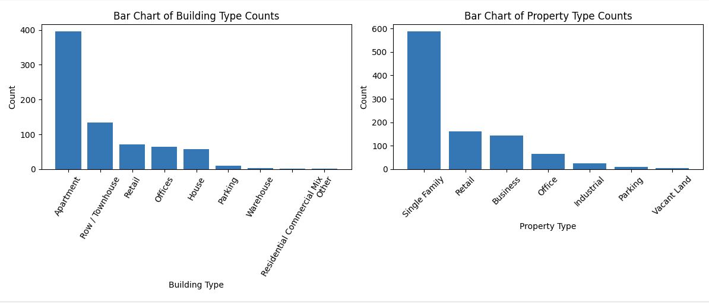

# Project Web Scraping

## Code Comparison

This project contains two code snippets that serve different purposes and use different libraries and APIs. In this README, we'll compare and explain these two code snippets.
- **Code 1 : Web_Scraping_One_Page**
- **Code 2 : Realtor_webSraping_API**
### Code 1: Web Scraping with BeautifulSoup (Web_Scraping_One_Page)

- **Purpose:** This code is designed to scrape real estate data from a specific web page using web scraping techniques.
- **Libraries Used:** It uses the `requests` library to send HTTP GET requests, `BeautifulSoup` for parsing HTML content, and `pandas` for data manipulation.
- **Workflow:**
  1. Sends an HTTP GET request to a specific URL.
  2. Parses the web page content with BeautifulSoup.
  3. Extracts real estate property information, such as price, address, bedrooms, and bathrooms, from the HTML.
  4. Stores the extracted data in a Pandas DataFrame.
  5. Outputs the first few rows of the DataFrame.

### Code 2: Real Estate Data Retrieval from Realtor.ca API (Realtor_webSraping_API)

- **Purpose:** This code is designed to retrieve real estate property data from the Realtor.ca API. It queries the API for property listings and details.
- **Libraries Used:** It uses the `requests` library to make HTTP requests and `pandas` for data handling.
- **Workflow:**
  1. Provides functions to query the Realtor.ca API for property listings based on various criteria, including location, price, and page.
  2. Includes a function to retrieve property details.
  3. Can save the results as a CSV file and resume querying from the last page if the process is interrupted.
  4. Has built-in error handling to handle rate limiting and other issues.

## Usage

You can choose between the two code snippets based on your specific use case and data source. If you need real-time data from a website, Code 1 may be suitable, but if you require data from Realtor.ca, Code 2 is more appropriate.

## License

This project is open-source and provided under the [MIT License](LICENSE.md).

---

## Code 1: Web Scraping with BeautifulSoup (Web_Scraping_One_Page)

### Overview

This Python code is dedicated to web scraping, a technique used to extract real estate property information from a specific web page. It utilizes several libraries, including `requests`, `BeautifulSoup`, and `pandas`, to effectively gather and structure the data.

#### Purpose

The primary purpose of this code is to collect detailed data about real estate properties listed on a particular web page. The extracted information includes the property's price, address, number of bedrooms, and number of bathrooms.

#### Libraries Used

1. `requests`: This library is utilized to send HTTP GET requests to the web page, facilitating the retrieval of the HTML content.
2. `BeautifulSoup`: Used for parsing the HTML content and extracting specific elements from the page.
3. `pandas`: It assists in organizing and manipulating the data into a structured format.

### Workflow

The code operates through the following sequence of steps:

1. An HTTP GET request is sent to a specific URL, which corresponds to the web page featuring real estate property listings.

2. The HTML content of the web page is obtained as a response.

3. `BeautifulSoup` is employed to parse the HTML content, simplifying the process of searching for and extracting relevant information.

4. The code identifies the list of property cards on the web page, where each card represents an individual real estate property.

5. For each property card, the following information is extracted:
   - Property price
   - Property address
   - Number of bedrooms
   - Number of bathrooms

6. The extracted data is stored in separate lists for each type of information (e.g., `priceList`, `addresselist`, `bedroomList`, and `bathroomsList`).

7. Subsequently, the code creates a structured DataFrame using `pandas`, where the extracted data is organized into columns, including 'Price,' 'Address,' 'Bedrooms,' and 'Bathrooms.'

8. Finally, the code provides a preview of the collected data by displaying the first few rows of the DataFrame.

**Note:**
If the code cannot locate the property list on the web page, it generates a message indicating that the property list was not found.

### Summary

In summary, this code equips the user with the ability to scrape and collect real estate property data from a web page, presenting it in an organized tabular format. This data can be further analyzed and utilized as needed.

---

## Code 2: Real Estate Data Retrieval from Realtor.ca API

### Overview

This Python code is designed to interact with the Realtor.ca API, a real estate database, and retrieve essential data about available properties. The code facilitates the retrieval of property listings, detailed property information, and more. It utilizes the `requests` library for making HTTP requests and `pandas` for efficient data handling.

#### Purpose

The primary purpose of this code is to provide an interface for accessing the Realtor.ca API to collect real estate property data. It allows users to obtain lists of properties based on various criteria and fetch detailed information about individual properties.

#### Functions and Workflow

**1. `get_coordinates(city)`**
- This function retrieves the geographical coordinates (bounding box) of a specified city from OpenStreetMap.
- It sends a query to the OpenStreetMap API using the city name.
- The response includes latitude and longitude bounds, which are used for property searches on Realtor.ca.

**2. `get_property_list(lat_min, lat_max, long_min, long_max, price_min, price_max, records_per_page, culture_id, current_page, application_id)`**
- This function queries the Realtor.ca API to obtain lists of real estate properties based on criteria such as geographical bounds, price range, and more.
- It sends a POST request to the Realtor.ca API with specified parameters and handles potential HTTP errors, including rate limiting.

**3. `get_property_details(property_id, mls_reference_number)`**
- This function retrieves detailed information about a specific property by querying the Realtor.ca API.
- It requires the property's unique identifier (property ID) and MLS reference number.
- The function constructs the API request URL and fetches property details, including features and images.

**4. `get_property_list_by_city(city)`**
- This function simplifies property retrieval for a given city by calling `get_property_list()`.
- It manages pagination, saves data to a CSV file, and can resume querying from the last page if interrupted.
- The function includes error handling for rate limiting and other potential issues.

**5. `get_property_details_from_csv(filename)`**
- This function retrieves detailed property information from a CSV file created by `get_property_list_by_city()`.
- It ensures properties are not re-queried if their details have already been fetched.
- The function saves the detailed data to the CSV file.

### Summary

In summary, this code offers a comprehensive set of functions to interact with the Realtor.ca API, facilitating access to real estate property data. It empowers users, including real estate professionals, researchers, and enthusiasts, to perform property searches, retrieve details, and manage data efficiently.

Feel free to integrate this section into your project's README file, along with other pertinent information and sections as needed.

---
## Data Analyzing
**In this section, we embark on a journey of data analysis, where we explore and derive valuable insights from the real estate data collected from Realtor.ca. Our dataset comprises up to 1000 records, and we are eager to uncover trends, patterns, and meaningful information within this wealth of property listings.**
## Data Preparation and Selection for Code 2 output

In this section, we will describe the data preparation and column selection process performed in our project. This code snippet is part of our data analysis workflow and aims to create a new DataFrame, `df_target`, containing specific columns of interest from our original dataset.

### Code Explanation

```python
import pandas as pd

# Read data from a CSV file located at "/content/Properties.csv"
results_df = pd.read_csv("/content/Properties.csv")

# Obtain the names of the columns in the DataFrame
column_names = results_df.columns

# Print the column names to the console
print(column_names)

# Create an empty DataFrame named "df_target"
df_target = pd.DataFrame()

# Define a list of columns to copy from the source DataFrame to the target DataFrame
columns_to copy = ['PostalCode', 'Building.SizeExterior', 'Building.SizeInterior', 'Property.Price',
                   'Property.Type', 'Building.Type', 'Property.Address.AddressText',
                   'Property.Address.Longitude', 'Property.Address.Latitude',
                   'Property.PriceUnformattedValue', 'Building.BathroomTotal', 'Building.Bedrooms',
                   'Property.ParkingType', 'RelativeDetailsURL', 'PublicRemarks', 'Individual']

# Copy the specified columns from the source DataFrame to the target DataFrame
df_target[columns_to_copy] = results_df[columns_to_copy]

# Display the first few rows of the target DataFrame
df_target.head()
```
## Real Estate Geographic Visualization with Folium

In this section, we will explain the code responsible for creating an interactive map using the `folium` library, which is a Python wrapper for Leaflet.js. This map will display the locations of properties based on latitude and longitude coordinates from our dataset.

<br />

<br />

### Code Explanation

```python
import folium
import pandas as pd

# Clean up the column names by removing trailing tab characters and extra whitespace
df_target.columns = df_target.columns.str.strip().str.replace('\t', '')

# Create a map centered at a specific location
m = folium.Map(location=[43.8563, -79.3370], zoom_start=12)

# Add markers for each data point from the DataFrame
for index, row in df_target.iterrows():
    folium.Marker([row['Property.Address.Latitude'], row['Property.Address.Longitude']], popup="Location").add_to(m)

# Save the map as an HTML file
m.save('map.html')

# Display the map
m
```
## Interactive Map Creation with Folium

The code presented below demonstrates the creation of an interactive map using the `folium` library and the manipulation of data with the `pandas` library.

### Code Breakdown

1. **Library Imports**: The code begins by importing the necessary libraries. `folium` is employed for interactive map creation, while `pandas` is used for data manipulation.

2. **Data Preparation**: It is assumed that `df_target` is a DataFrame containing the data. The code initiates by cleaning up the column names in this DataFrame. This is done to ensure uniformity and to prevent potential issues when accessing data via column names.

3. **Map Initialization**: A new `folium.Map` object, named `m`, is created. It is centered at a specific geographical location defined by latitude and longitude coordinates. The parameter `zoom_start` sets the initial zoom level of the map.

4. **Marker Placement**: The code then enters a loop to iterate through each row in the DataFrame. For each row, a `folium.Marker` object is created and placed on the map. These markers are positioned according to the latitude and longitude coordinates specified in the dataset. A pop-up message labeled "Location" appears when a marker is clicked.

5. **Adding Markers**: Markers are added to the map using the `add_to(m)` method. This associates the markers with the map object.

6. **Saving the Map**: The interactive map is saved as an HTML file named 'map.html' using the `m.save('map.html')` statement. The HTML file can be opened in a web browser, allowing for interactive exploration.

7. **Display**: Finally, the map can be displayed directly within the code environment, such as a Jupyter Notebook, by simply including the `m` object.

This code effectively generates an interactive map with markers representing property locations based on latitude and longitude coordinates. It provides a visual representation of property distributions, which can be saved as an HTML file for sharing and further exploration.

For more detailed insights from the map, please refer to the data visualization section of this project.

---

## Geospatial Data Visualization with Matplotlib

In this section, we'll explain the code responsible for creating a scatter plot that visualizes geographical data using the `Matplotlib` library. The code focuses on displaying property locations on a map based on latitude and longitude coordinates from the dataset.
<br />

<br />
### Code Explanation

```python
import matplotlib.pyplot as plt
import pandas as pd

# Data Preparation
df_target.columns = df_target.columns.str.strip().str.replace('\t', '')

# Scatter Plot Creation
plt.scatter(df_target['Property.Address.Longitude'], df_target['Property.Address.Latitude'], c='blue', marker='o', label='Cities')

# Axes Labels and Title
plt.xlabel('Longitude')
plt.ylabel('Latitude')
plt.title('Map Visualization with Matplotlib')

# Legend
plt.legend()

# Grid Lines
plt.grid(True)

# Display the Plot
plt.show()
```
## Code Breakdown

The code can be broken down into the following steps:

1. **Importing Matplotlib**: The code begins by importing the Matplotlib library as `plt`, which is a powerful tool for creating data visualizations, including scatter plots.

2. **Data Preparation**: The data in `df_target` is prepared by cleaning up the column names to ensure uniformity and remove potential issues when accessing data via column names.

3. **Creating the Scatter Plot**: A scatter plot is created using `plt.scatter()`. This plot displays the geographical data by plotting latitude on the y-axis and longitude on the x-axis. Each point on the plot represents a property location. The color is set to blue ('c='blue''), and the marker style is set to 'o' (a circle). A label 'Cities' is added to the plot.

4. **Defining Axes Labels and Title**: Axes labels are defined with `plt.xlabel()` for the x-axis and `plt.ylabel()` for the y-axis. A title for the plot is set using `plt.title()`.

5. **Adding a Legend**: A legend is included in the plot with `plt.legend()`, which will display the label 'Cities' alongside the data points.

6. **Enhancing Readability**: Grid lines are added to the plot with `plt.grid(True)` to improve the readability of the visualization.

7. **Displaying the Plot**: Finally, the plot is displayed using `plt.show()`.

This code effectively creates a scatter plot that visualizes property locations on a map based on latitude and longitude coordinates. The resulting plot offers a clear representation of the geographical distribution of the properties in the dataset.

For further insights and analysis based on this visualization, please refer to the data visualization section of this project.

---

## Data Visualization with Bar Charts

In this section, we will explain the code responsible for creating two bar charts using the `Matplotlib` library. The code visualizes property and building types by plotting their counts, providing insights into the distribution of property and building types in the dataset.

<br />

<br />

### Code Explanation

```python
import pandas as pd
import matplotlib.pyplot as plt

# Create a new figure with two subplots
fig, (ax2, ax1) = plt.subplots(1, 2, figsize=(12, 5))

# Plot the first bar chart in the first subplot
type_counts1 = df_target['Property.Type'].value_counts()
ax1.bar(type_counts1.index, type_counts1)
ax1.set_xlabel('Property Type')
ax1.set_ylabel('Count')
ax1.set_title('Bar Chart of Property Type Counts')
ax1.tick_params(axis='x', rotation=45)

# Plot the second bar chart in the second subplot
type_counts2 = df_target['Building.Type'].value_counts()
ax2.bar(type_counts2.index, type_counts2)
ax2.set_xlabel('Building Type')
ax2.set_ylabel('Count')
ax2.set_title('Bar Chart of Building Type Counts')
ax2.tick_params(axis='x', rotation=60)

# Adjust spacing between subplots
plt.tight_layout()

# Show the combined figure with both subplots
plt.show()
```
## Code Breakdown

- **Library Imports**: The code starts by importing the necessary libraries. `pandas` is used for data manipulation, and `Matplotlib` is used for data visualization.

- **Subplots Creation**: A new figure is created with two subplots using `plt.subplots()`. This allows for side-by-side visualization of the two bar charts. The `figsize` parameter sets the size of the figure.

- **First Bar Chart**: In the first subplot (`ax1`), a bar chart is plotted. The counts of property types are obtained using `df_target['Property.Type'].value_counts()`, and the data is plotted using `ax1.bar()`. Axes labels, title, and rotation of the x-axis labels are set to make the plot more informative and readable.

- **Second Bar Chart**: In the second subplot (`ax2`), a similar process is followed to create a bar chart for building types. Counts of building types are obtained, and the bar chart is plotted. Axes labels, title, and x-axis label rotation are adjusted accordingly.

- **Spacing Adjustment**: `plt.tight_layout()` is used to adjust the spacing between the subplots for better presentation.

- **Display**: The combined figure with both subplots is displayed using `plt.show()`.

This code effectively creates two bar charts side by side, offering insights into the distribution of property and building types in the dataset. The resulting visualizations provide a clear understanding of the data's composition.

For additional analysis and interpretations of these bar charts, please refer to the data visualization section of this project.

---

## City Extraction and Data Visualization with Bar Charts

## Introduction

This code is designed to extract city information from property addresses, create a new 'City' column in the dataset, and visualize the distribution of properties among different cities using a bar chart. The code aims to provide insights into the geographical distribution of properties.

<br />

<br />

### Code Explanation

```python
# Define a function to extract the city from an address
def extract_city(address):
    parts = address.split('|')
    if len parts == 2:
        city_part = parts[1].split(',')[0].strip()
        return city_part
    print(address)
    return "City not found"

df_target.columns = df_target.columns.str.strip().str.replace('\t', '')

# Apply the function to the 'Property.Address.AddressText' column to create a new 'City' column
df_target['City'] = df_target['Property.Address.AddressText'].apply(extract_city)

# Show the updated DataFrame
df_target.head()

# Group by 'city' and count occurrences
type_counts = df_target['City'].value_counts()

# Create a bar chart
plt.bar(type_counts.index, type_counts)
plt.xlabel('City')
plt.ylabel('Count')
plt.title('Bar Chart of City Counts')

# Rotate the x-labels by 45 degrees for better readability
plt.xticks(rotation=45)

plt.show()
```
## Code Breakdown

- **City Extraction Function**: The code begins by defining a function named `extract_city(address)` to extract the city from an address. It splits the address into parts, and if the address has two parts, it extracts the city information. If not, it returns "City not found."

- **Data Preparation**: The column names in the dataset (`df_target`) are cleaned to ensure uniformity and prevent potential issues when accessing data via column names.

- **City Data Extraction**: The function `extract_city` is applied to the 'Property.Address.AddressText' column to create a new column called 'City' in the DataFrame. This 'City' column contains the extracted city information.

- **Data Preview**: The code displays the first few rows of the updated DataFrame using `df_target.head()` to provide an overview of the data.

- **City Count Analysis**: The code groups the data by 'City' and counts the occurrences of each city in the dataset.

- **Bar Chart Creation**: A bar chart is created using Matplotlib (`plt.bar()`) to visualize the city counts. The x-axis represents cities, the y-axis represents the count of properties in each city, and the chart title is set as 'Bar Chart of City Counts.'

- **X-Label Rotation**: To enhance the readability of the x-axis labels, they are rotated by 45 degrees using `plt.xticks(rotation=45)`.

- **Display the Chart**: The final step is displaying the bar chart using `plt.show()`.

## Usage

To use this code for your project, you can adapt it to your dataset and column names. Make sure to have the required dependencies installed: pandas and Matplotlib. After making necessary adjustments, run the code to extract city information, create the 'City' column, and visualize the distribution of properties.

## Dependencies

This code relies on the following Python libraries:
- pandas
- Matplotlib

Make sure to have these libraries installed in your Python environment.

## License

This code is open-source and available under the [MIT License](LICENSE). You are free to use and modify it according to your project's needs.

For additional analysis and interpretations based on this visualization, please refer to the data analysis section of this project.

